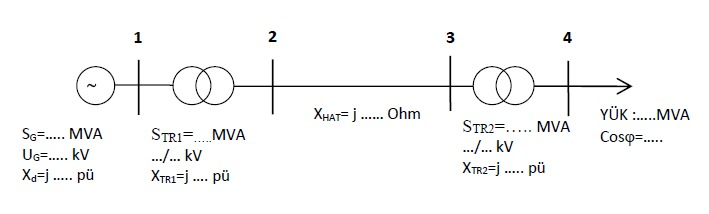

# Transmission System Per-Unit Impedance Analysis

Excel-based per-unit impedance calculation for a four-bus transmission system containing a generator, two transformers, a transmission line, and a lagging-power-factor load.



## Project objective

This project provides a formula-driven solution for calculating the per-unit impedances of every component in the illustrated transmission system on a common MVA and kV base. It also calculates base current, base impedance, load impedance, and the active and reactive components of the load current.

## Selected system data

| Component | Rating or value | Voltage | Original reactance |
| --- | ---: | ---: | ---: |
| Generator | 140 MVA | 15 kV | 0.25 pu |
| Transformer 1 | 180 MVA | 15/154 kV | 0.15 pu |
| Transmission line | 80 ohm | 154 kV base | - |
| Transformer 2 | 140 MVA | 154/35 kV | 0.15 pu |
| Load | 70 MVA, 0.8 lagging power factor | 35 kV | - |

The project uses the design constraints `S_G <= S_TR1`, `S_TR1 >= S_TR2`, and `S_TR2 > S_load`. Generator and transformer reactances are selected from the 0.10-0.50 pu range, while the transmission-line reactance is selected from the 40-160 ohm range.

## Common base

- Base apparent power: 100 MVA
- Transmission-side base voltage: 154 kV
- Generator-side base voltage: 15 kV
- Load-side base voltage: 35 kV

The voltage bases follow the transformer ratios. The workbook links its formulas to the base cells, so changing the selected base values causes the dependent per-unit quantities to be recalculated by Excel.

## Main formulas

```text
I_base = S_base / (sqrt(3) V_base)
Z_base = V_base^2 / S_base
X_new(pu) = X_old(pu) (S_base / S_rated) (V_rated / V_base)^2
X_line(pu) = X_line(ohm) / Z_base
Z_load(ohm) = V_load^2 / S_load
Z_load(pu) = Z_load(ohm) / Z_base
```

For the 0.8 lagging-power-factor load, `cos(phi) = 0.8` and `sin(phi) = 0.6`. The workbook resolves the per-unit load impedance and current into real and reactive components.

## Verified results

| Quantity | Result |
| --- | ---: |
| Generator reactance | 0.178571 pu |
| Transmission-line reactance | 0.337325 pu |
| Transformer 1 reactance | 0.083333 pu |
| Transformer 2 reactance | 0.107143 pu |
| Load impedance magnitude | 1.428571 pu |
| Load resistance | 1.142857 pu |
| Load reactance | 0.857143 pu |
| Load-current magnitude | 0.700000 pu |
| Active current component | 0.560000 pu |
| Reactive current component | -0.420000 pu |

The cached workbook outputs were independently recalculated from the input cells and matched without numerical differences. No broken-reference or Excel formula-error values were found.

## Workbook

Open [`transmission-system-per-unit-impedance-analysis.xlsx`](transmission-system-per-unit-impedance-analysis.xlsx) in Microsoft Excel and change the ratings, voltage bases, reactances, line impedance, or load power factor in the input area. Excel is configured to perform a full recalculation when the workbook opens.

The worksheet label `EMPEDANS(MVA)` is a display-label typo retained from the original submission. The formulas in that row calculate base impedance, and the associated result cells correctly use ohms.

## Repository contents

| Path | Description |
| --- | --- |
| `transmission-system-per-unit-impedance-analysis.xlsx` | Formula-driven per-unit calculation workbook |
| `assets/single-line-diagram.jpg` | Four-bus system topology used in the workbook |
| `README.md` | Project objective, input data, equations, and verified results |
